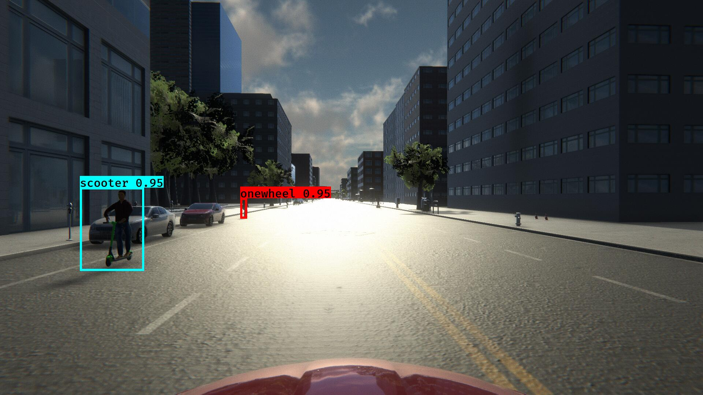
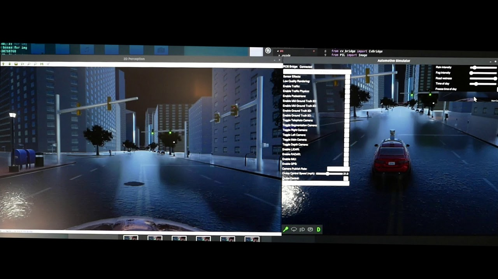

# keras-yolo3
### YOLOv3 implementation in Keras with TensorFlow backend trained on multiple datasets for validation of synthetic Image data for Autonomous Driving

[](LICENSE)

## Introduction

The original implementation comes from [qqwweee/keras-yolo3](https://github.com/qqwweee/keras-yolo3).

<!-- Our YOLO3 detects 5 different micro-mobility vehicles from the images captured by the [LGSVL Automotive Simulator Micromobility version](https://github.com/deepaktalwardt/lgsvl_simulator_micromobility). The vehicles we are interested in detecting include scooters, hoverboards, skateboards, segways, and one-wheels. -->

## Quick Start

1. Download pretrained weights [here](https://www.dropbox.com/s/a44ly3zd6bzmssw/2d-final-weights-keras-yolo3.h5?dl=0).
2. Move the downloaded .h5 file inside [model_data](model_data)
3. Run YOLO detection.
```
python inference.py [OPTIONS...] --image, for image detection mode
```

### Usage
Use --help to see usage of inference.py:
```
usage: inference.py [-h] [--model MODEL] [--anchors ANCHORS]
                     [--classes CLASSES] [--gpu_num GPU_NUM] [--image]

required arguments:
  --image            Image detection mode

optional arguments:
  -h, --help         show this help message and exit
  --model MODEL      path to model weight file, default model_data/yolo.h5
  --anchors ANCHORS  path to anchor definitions, default
                     model_data/yolo_anchors.txt
  --classes CLASSES  path to class definitions, default
                     model_data/coco_classes.txt
  --gpu_num GPU_NUM  Number of GPU to use, default 1
```


## Data collection

## Inference

## Evaluation


### Extracting waymo datasets into GCP buckets
1. Download the waymo dataset files(first 3 only for images training) [here](https://waymo.com/open/download/#)
2. Extract the tar file to get the list of segments.
3. Submit the path of all the segments to [training_data_to_gcs.ipynb](https://github.com/saching13/Validation-of-Synthetic-Image-data-for-Autonomous-Driving/blob/master/training_data_to_gcs.ipynb) or [validation_to_gcs.ipynb](https://github.com/saching13/Validation-of-Synthetic-Image-data-for-Autonomous-Driving/blob/master/validation_to_gcs.ipynb)
4. Update the cloud bucket path in the notebook to write the extracted images, tf records and annotation file to google cloud storage.

#### [Training_data_to_gcs.ipynb](https://github.com/saching13/Validation-of-Synthetic-Image-data-for-Autonomous-Driving/blob/master/training_data_to_gcs.ipynb) 
This files takes list of tfrecords of waymo from local or gcp buckets as input and creates tfrecords in the the cloud buckets.

#### [validation_to_gcs.ipynb](https://github.com/saching13/Validation-of-Synthetic-Image-data-for-Autonomous-Driving/blob/master/validation_to_gcs.ipynb)
This files also takes list of tfrecords of waymo from local or gcp buckets as input and creates tfrecords along with jpeg files and annotation file in the the cloud bucket.

#### TFRecord prototxt format:
TFRecord of waymo had more information including LIDAR scan with their own proto format. we simplified it to the following format with only images and it's annotations.

Our TFrecord format.
```

feature={
      'image/filename': dataset_util.bytes_feature(filename),
      'image/format': dataset_util.bytes_feature(image_format),
      'image/encoded': dataset_util.bytes_feature(encoded_image_data),
      'image/object/bbox/center_x': dataset_util.float_list_feature(center_x),
      'image/object/bbox/center_y': dataset_util.float_list_feature(center_y),
      'image/object/bbox/width': dataset_util.float_list_feature(width),
      'image/object/bbox/height': dataset_util.float_list_feature(height),
      'image/object/class/text': dataset_util.bytes_list_feature(classes_text),
      'image/object/class/label': dataset_util.int64_list_feature(classes),
  }

```

### Converting KITTI dataset to YOLOV3 finput format

1. Kitti dataset is a stero camera dataset.
2. Dataset is of the format that each image contains it's individual text file which contains the class name, bounding box and other information.
3. we needed to convert it into single annotation file with bounding box, class. 
4. pass the list of annotation files of kitti dataset into [annotation_converter_kitti.py](https://github.com/saching13/Validation-of-Synthetic-Image-data-for-Autonomous-Driving/blob/master/annotation_converter_kitti.py) to create a single annotation file.

Kitti dataset can be found [here](http://www.cvlibs.net/datasets/kitti/eval_object.php?obj_benchmark=2d)

#### [image annotator.ipynb](https://github.com/saching13/Validation-of-Synthetic-Image-data-for-Autonomous-Driving/blob/master/image%20annotator.ipynb)

  On passsing the images folder path  and annotation file with bounding boxes it will generate images with bounding boxes for visualization. set `gcs = False` to create the output files in local file system and `True` to create files in GCP.


### ROS
If you are trying to run inferences on LGSVL simulators using ROS nodes, `get_detections` function in `yolo.py` returns 2D bounding box information.

ROS nodes that were created for this project are available [here](https://github.com/deepaktalwardt/lgsvl_micromobility_ros_pkgs).

## Training

1. Generate your own annotation file and class names file.  
    One row for one image;  
    Row format: `image_file_path box1 box2 ... boxN`;  
    Box format: `x_min,y_min,x_max,y_max,class_id` (no space).  
    For VOC dataset, try `python voc_annotation.py`  
    Here is an example:
    ```
    path/to/img1.jpg 50,100,150,200,0 30,50,200,120,3
    path/to/img2.jpg 120,300,250,600,2
    ...
    ```

2. Modify train.py and start training.  
    `python train.py`  
    Use your trained weights or checkpoint weights with command line option `--model model_file` when using `inference.py`
    Remember to modify class path or anchor path, with `--classes class_file` and `--anchors anchor_file`.

3. You can access to our datasets we trained our model on from here. These two datasets are separated because they were collected in different times. Setups and formats are identical.

* [Dataset 1](https://www.dropbox.com/s/9cvsmraio6q6v0d/large_dataset_1.zip?dl=0)

* [Dataset 2](https://www.dropbox.com/s/kt6hwfsa95v4hck/large_dataset_2.zip?dl=0)

## Results

### Images




### Video - Real-time inference on frames captured from the Simulator
[](https://www.youtube.com/watch?v=DwWY89dVGEw)

## Contributors
* **Deepak Talwar** - (https://github.com/deepaktalwardt)
* **Seung Won Lee** - (https://github.com/swdev1202)
### This repository was originally developed for CMPE 297 - Autonomous Driving course at San Jose State University in Spring 2019.
